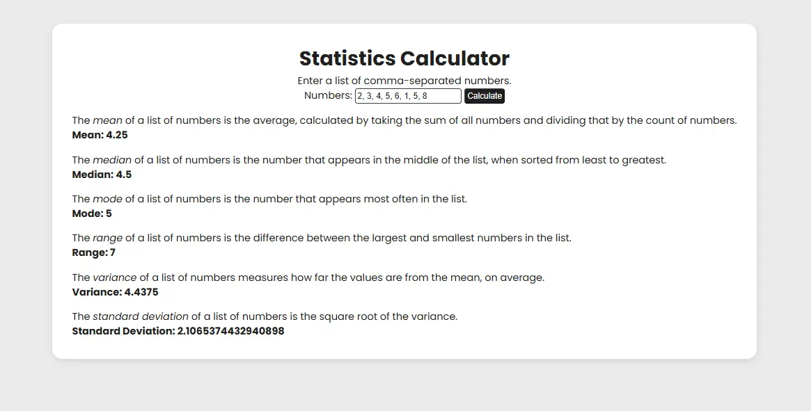

# 📊 Statistics Calculator

A simple statistics calculator built in JavaScript while following the [FreeCodeCamp](https://www.freecodecamp.org/learn/javascript-algorithms-and-data-structures-v8/learn-advanced-array-methods-by-building-a-statistics-calculator/) *Advanced Array Methods* course.  

It demonstrates how to use JavaScript array methods like `.reduce()`, `.map()`, `.filter()`, and `.sort()` to compute statistical values.

## 📷 Preview



## ✨ Features

- ✅ Mean (average)  
- ✅ Median  
- ✅ Mode  
- ✅ Range  
- ✅ Variance  
- ✅ Standard Deviation   

## 📂 Project Structure

```
.
├── index.html
├── script.js
└── style.css 

## 🚀 How to Use

1. Clone the repository:
   ```bash
   git clone https://github.com/gusavila/statistics-calculator.git
   cd statistics-calculator
   ```
2. Open `index.html` in your browser.  
3. Enter a list of numbers separated by commas, e.g.:  
   ```
   10, 20, 30, 40, 50
   ```
4. The calculator will display the **mean, median, mode, range, variance, and standard deviation**.

## 🛠️ Built With

- **JavaScript (ES6+)**  
- **HTML5**  
- **CSS3**  
- [FreeCodeCamp](https://www.freecodecamp.org/) learning resources  

## 📖 Learning Goals

This project was created to practice:
- Advanced array methods in JavaScript (`map`, `filter`, `reduce`, `sort`)  
- DOM manipulation  
- Implementing core statistical formulas  

## 🤝 Contributing

Pull requests and feedback are welcome! If you spot bugs or have ideas to enhance the UI/UX, feel free to submit a PR.

## 📚 Acknowledgments

[FreeCodeCamp](https://www.freecodecamp.org/) for providing the project idea and guidance.
